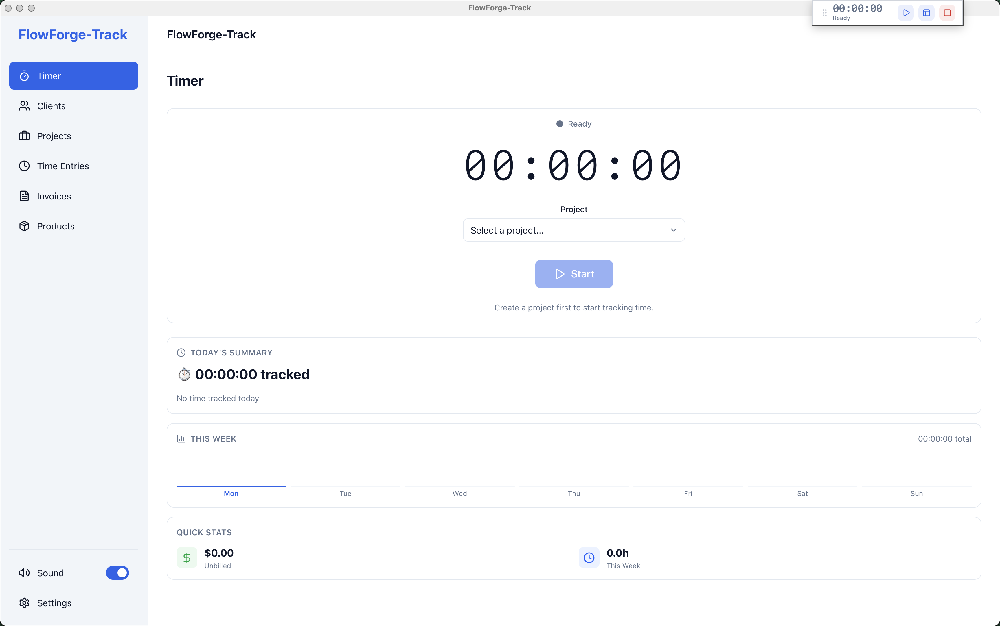

# FlowForge-Track

A simple, focused desktop app for tracking your work time and creating invoices. Built with privacy in mind — all your data stays on your computer.

Designed to be easy to use, especially for people who prefer clear interfaces and minimal distractions.



## 📥 Download

| Platform | Download | Notes |
|----------|----------|-------|
| **macOS** | [Download .dmg](https://github.com/EmminiX/FlowForge-Timetrack/releases/latest) | macOS 10.15+ |
| **Windows** | [Download .exe](https://github.com/EmminiX/FlowForge-Timetrack/releases/latest) | Windows 10+ |
| **Linux** | [Download .AppImage](https://github.com/EmminiX/FlowForge-Timetrack/releases/latest) | Most distros |

> **Note:** The app is not code-signed yet. See [Installation Guide](#-installation-guide) below for how to open it.

## 🌟 Key Features

- **Floating Timer Widget** — A small always-on-top window so you always see your timer, positioned at the corner of your app
- **Client & Project Management** — Organize your work with clients and projects
- **Offline Invoicing** — Create professional PDF invoices without needing the internet
- **Global Keyboard Shortcuts** — Control the timer from anywhere:
  - `Cmd+Shift+S` (Mac) / `Ctrl+Shift+S` (Win/Linux) — Start/Resume
  - `Cmd+Shift+P` (Mac) / `Ctrl+Shift+P` (Win/Linux) — Pause
  - `Cmd+Shift+X` (Mac) / `Ctrl+Shift+X` (Win/Linux) — Stop & Save
- **Pomodoro Timer** — Built-in work/break intervals (25/5 min default, customizable)
- **Dashboard Analytics** — Visual breakdown of your daily and weekly progress
- **Smart Idle Detection** — Automatically pauses the timer when you step away
- **Customizable UI** — Light/Dark theme, adjustable font size and density
- **100% Offline** — All data stored locally in SQLite, no cloud required

## 🛡️ Data Protection

FlowForge-Track includes built-in protection against accidental data loss:

- **Cascading Delete Protection** — You cannot delete a client that has projects, or a project that has time entries
- **Delete Order** — To remove a client completely, you must first delete their time entries, then projects, then the client
- **No Undo Needed** — This deliberate friction prevents accidental deletion of important billing data

## 📦 Installation Guide

### macOS

Since the app isn't code-signed yet, macOS will show a security warning:

1. Download the `.dmg` file
2. Open it and drag FlowForge-Track to Applications
3. **First launch:** Right-click the app → Select "Open" → Click "Open" in the dialog
4. Grant Accessibility permissions for keyboard shortcuts:
   - System Settings → Privacy & Security → Accessibility
   - Click `+` and add FlowForge-Track

### Windows

Windows SmartScreen may show a warning:

1. Download the `.exe` installer
2. If you see "Windows protected your PC", click "More info"
3. Click "Run anyway"
4. Follow the installation wizard

### Linux

1. Download the `.AppImage` file
2. Make it executable: `chmod +x FlowForge-Track.AppImage`
3. Run it: `./FlowForge-Track.AppImage`

## 🚀 Quick Start

1. **Add a Client** — Go to Clients → New Client
2. **Create a Project** — Go to Projects → New Project (link it to your client)
3. **Start Tracking** — Go to Timer → Select project → Click Start
4. **Create Invoice** — Go to Invoices → New Invoice → Select client and time entries

## 🛠 For Developers

### Tech Stack

- **Frontend:** React 19, TypeScript, Tailwind CSS 4, Zustand
- **Backend:** Tauri 2 (Rust)
- **Database:** SQLite (local)
- **Build:** Vite 7

### Requirements

- [Rust](https://www.rust-lang.org/) (latest stable)
- [Node.js](https://nodejs.org/) (v20+)
- [pnpm](https://pnpm.io/)

### Development

```bash
# Install dependencies
pnpm install

# Start development mode
pnpm tauri dev

# Run tests
pnpm test

# Type check
pnpm exec tsc --noEmit
```

### Build

```bash
# Build for current platform
pnpm tauri build
```

Outputs are in `src-tauri/target/release/bundle/`

### Project Structure

```
src/                    # React frontend
├── components/         # Shared UI components
├── features/          # Feature modules (timer, clients, invoices, etc.)
├── services/          # Database service layer
├── stores/            # Zustand state stores
└── types/             # TypeScript types

src-tauri/             # Rust backend
├── src/lib.rs         # Main Tauri setup, commands, migrations
└── tauri.conf.json    # App configuration
```

## 📄 License

**Non-Commercial Use Only**

This software is open source and free to use for **personal, educational, and non-commercial purposes**.

**You may:**
- ✅ Use it for personal time tracking and invoicing
- ✅ Use it within your team or organization (non-profit use)
- ✅ Modify and customize it for your own needs
- ✅ Share it with others
- ✅ Contribute improvements back to the project

**You may NOT:**
- ❌ Sell this software or any derivative of it
- ❌ Use it as part of a commercial product or service
- ❌ Generate revenue from this software in any way
- ❌ Remove attribution or claim it as your own work

See [LICENSE](LICENSE) for full legal details.

## 🤝 Contributing

Contributions are welcome! Please feel free to submit a Pull Request. By contributing, you agree that your contributions will be licensed under the same non-commercial terms.

---

## 👨‍💻 About

**Made with ❤️ by [Emmi](https://emmi.zone)** — for freelancers and small teams who value simplicity and privacy.

FlowForge-Track was born from the need for a simple, privacy-focused time tracking tool that doesn't require subscriptions, cloud accounts, or complex setup. It's built to respect your data and your workflow.

**Connect:**
- 🌐 Website: [emmi.zone](https://emmi.zone)
- 📝 Blog: [blog.emmi.zone](https://blog.emmi.zone)
- 💼 LinkedIn: [linkedin.com/in/emmic](https://www.linkedin.com/in/emmic/)

---

*This project is open source but not for commercial use. If you find it valuable, consider sharing it with others who might benefit from it.*
